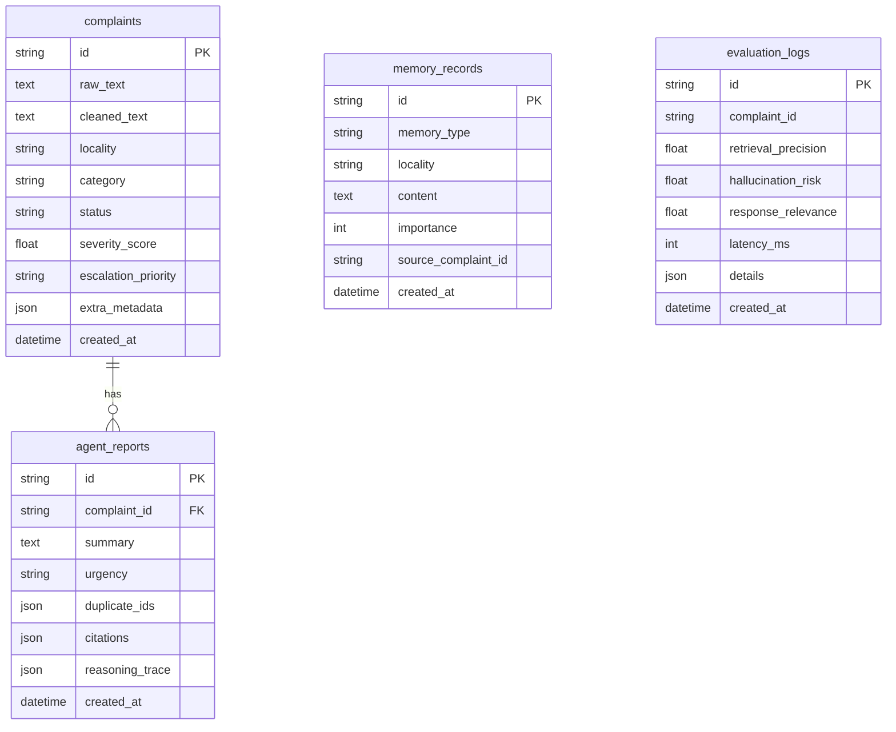

# Database Schema Diagram

```mermaid
erDiagram
  complaints ||--o{ agent_reports : has
  complaints {
    string id PK
    text raw_text
    text cleaned_text
    string locality
    string category
    string status
    float severity_score
    string escalation_priority
    json extra_metadata
    datetime created_at
  }
  agent_reports {
    string id PK
    string complaint_id FK
    text summary
    string urgency
    json duplicate_ids
    json citations
    json reasoning_trace
    datetime created_at
  }
  memory_records {
    string id PK
    string memory_type
    string locality
    text content
    int importance
    string source_complaint_id
    datetime created_at
  }
  evaluation_logs {
    string id PK
    string complaint_id
    float retrieval_precision
    float hallucination_risk
    float response_relevance
    int latency_ms
    json details
    datetime created_at
  }
```

