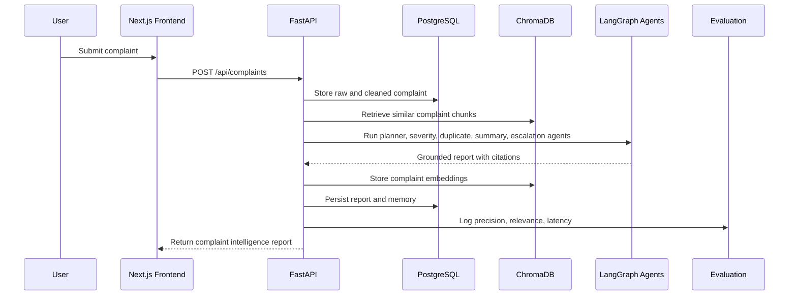

# Complaint Processing Sequence

```mermaid
sequenceDiagram
  participant U as User
  participant F as Next.js Frontend
  participant A as FastAPI
  participant P as PostgreSQL
  participant V as ChromaDB
  participant G as LangGraph Agents
  participant E as Evaluation

  U->>F: Submit complaint
  F->>A: POST /api/complaints
  A->>P: Store raw and cleaned complaint
  A->>V: Retrieve similar complaint chunks
  A->>G: Run planner, severity, duplicate, summary, escalation agents
  G-->>A: Grounded report with citations
  A->>V: Store complaint embeddings
  A->>P: Persist report and memory
  A->>E: Log precision, relevance, latency
  A-->>F: Return complaint intelligence report
```

