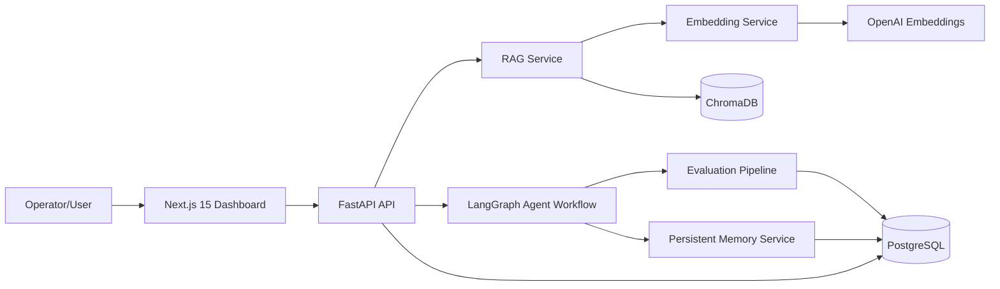

# System Architecture Diagram

```mermaid
flowchart LR
  User[Operator/User] --> UI[Next.js 15 Dashboard]
  UI --> API[FastAPI API]
  API --> DB[(PostgreSQL)]
  API --> RAG[RAG Service]
  RAG --> Embed[Embedding Service]
  Embed --> OpenAI[OpenAI Embeddings]
  RAG --> Vector[(ChromaDB)]
  API --> Graph[LangGraph Agent Workflow]
  Graph --> Memory[Persistent Memory Service]
  Memory --> DB
  Graph --> Eval[Evaluation Pipeline]
  Eval --> DB
```

